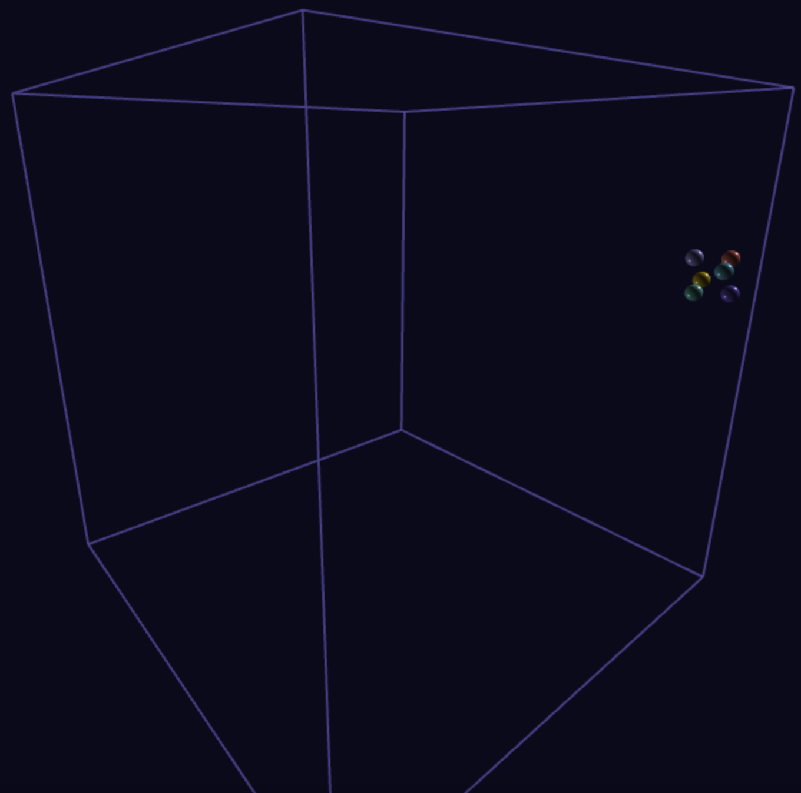
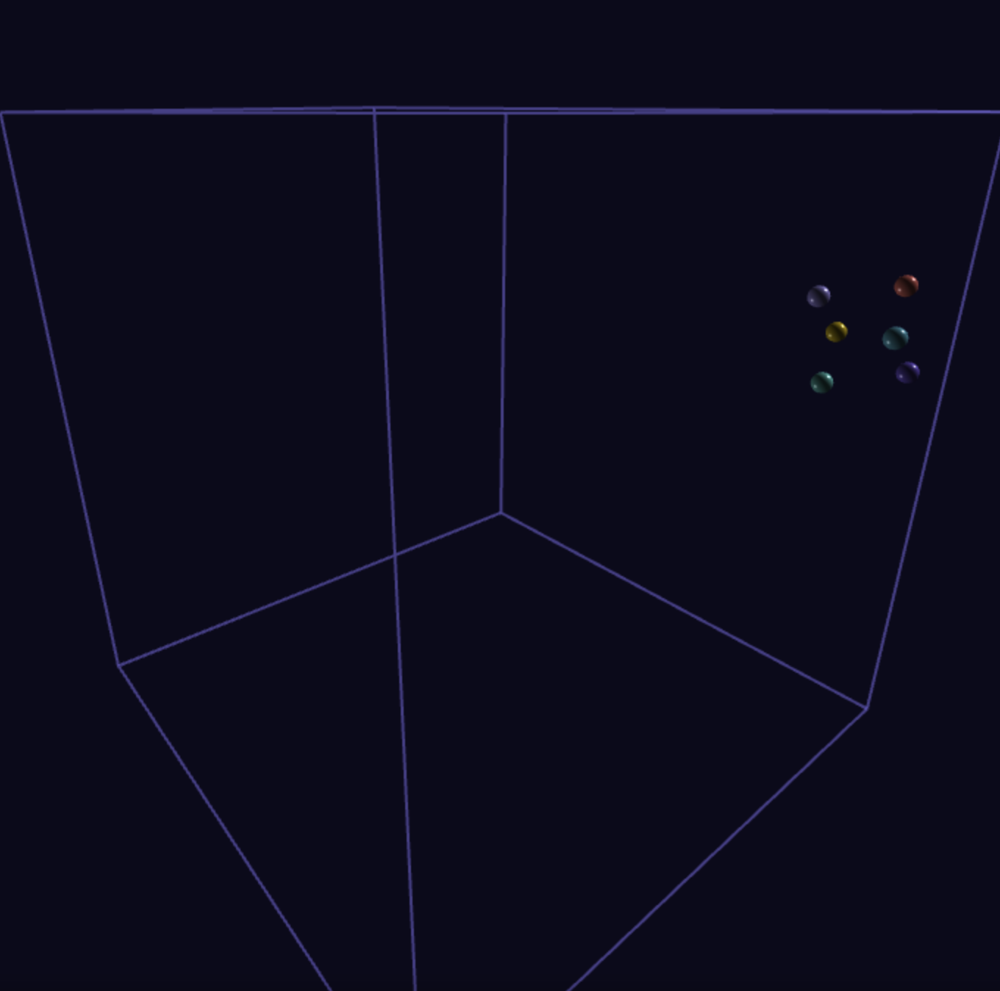
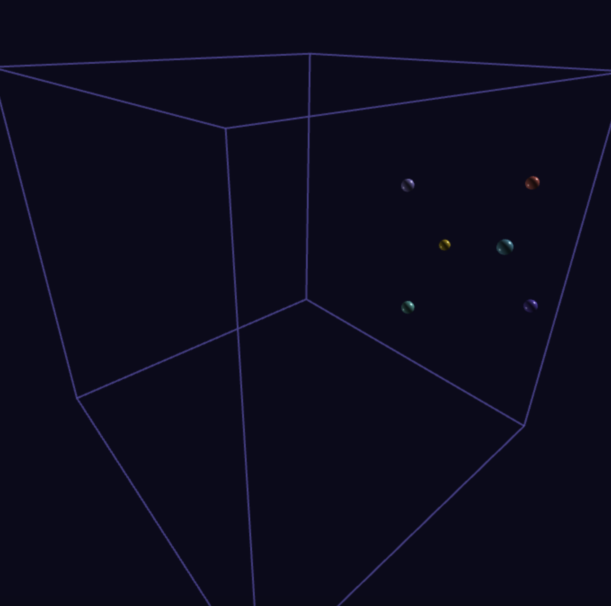
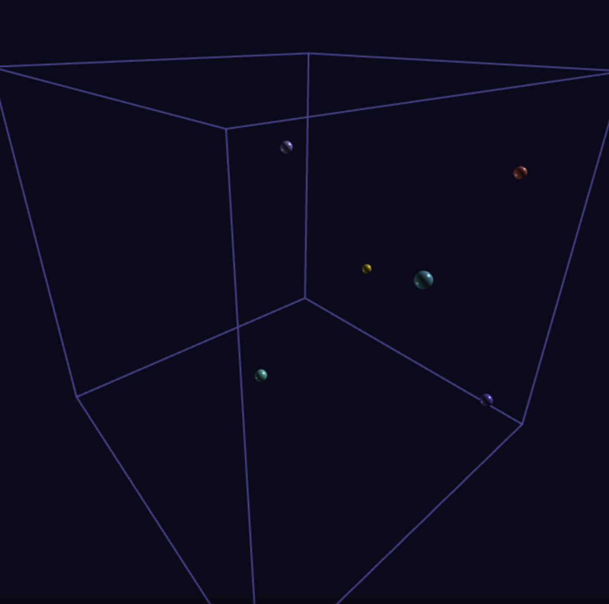

# 🔬 3D Variety Minimization Simulation

An interactive 3D visualization of the **Leibniz Variety** optimization problem, demonstrating how particles arrange themselves to minimize a mathematical variety function.


## Overview

This project visualizes the minimization of the **Variety Function**:

```
V = √(Σr²) · Σ(1/r)
```

Where `r` represents the pairwise distances between particles in 3D space. The simulation uses gradient descent to find optimal particle configurations that minimize this function.


### Leibniz’s Concept of Variety

Leibniz uses variety (varietas) in multiple places (e.g., Monadology, Discourse on Metaphysics, letters), often paired with order (ordo) or unity (unitas). For Leibniz:

The best possible world (a key theme in his theodicy) is one with the greatest variety (multiplicity of phenomena) combined with the greatest order (simplicity of laws).

Variety here means: the richness and differentiation of states, substances, and their relations.

He writes in the Monadology (§58):

> "The supreme wisdom of God consists in combining the maximum variety with the maximum order; in other words, producing the greatest multiplicity of phenomena by the simplest means."

In other words, variety measures the complexity or richness of the network of relations among things. Space and time, as Leibniz conceives them, are not substances but systems of relations — precisely the kind of structure variety quantifies.

Thus, space-time is a derived order from variety:

Space = the order of coexisting relations.

Time = the order of successive relations.

If there were no variety (no multiplicity of substances/events), then there would be no space or time at all because order without relata collapses. This makes relationalism a natural extension of his variety principle.


### Key Mathematical Insight: Scale Invariance

**Variety is scale invariant**: For any scalar `c > 0`, we have `V(cx) = V(x)`. This means only the *direction* of particle positions matters for optimization, not their absolute scale.







## Getting Started

### Quick Start
1. **Clone the repository**:
   ```bash
   git clone https://github.com/roholazandie/leibniz-variety.git
   cd leibniz-variety
   ```

2. **Open in browser**:
   ```bash
   # Simply open index.html in any modern web browser
   open index.html
   # or
   python -m http.server 8000  # For local server
   ```


### Mathematical Foundation
The variety function combines two competing forces:
- **√(Σr²)**: Encourages particles to spread out
- **Σ(1/r)**: Penalizes particles that are too close

### Optimization Algorithm
1. **Calculate** pairwise distances between all particles
2. **Compute** variety function and its gradient
3. **Update** particle positions using gradient descent
4. **Apply** boundary constraints to keep particles in bounds
5. **Repeat** until convergence or user interaction

### Theoretical Minimum
For `n` particles, the theoretical minimum is approximately `R^(3/2)` where `R = n(n-1)/2` is the number of particle pairs.